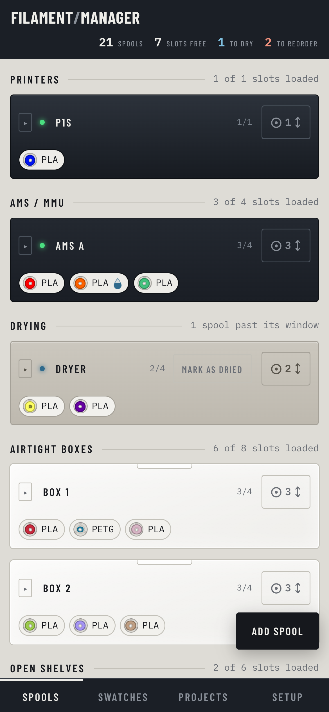
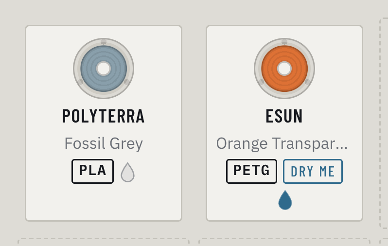
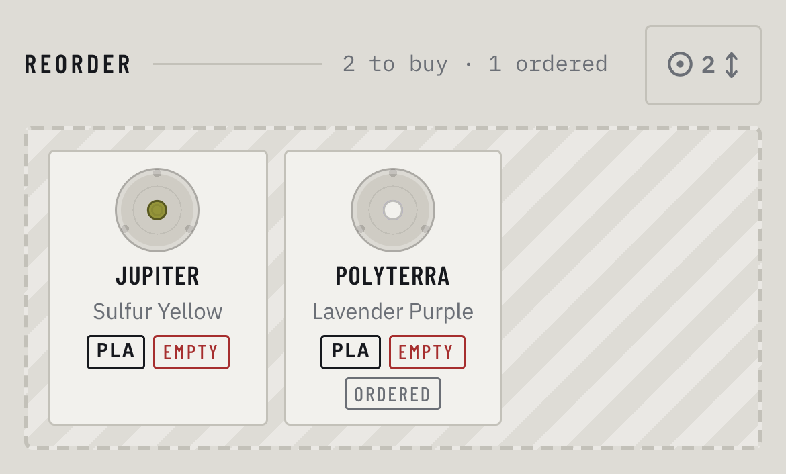
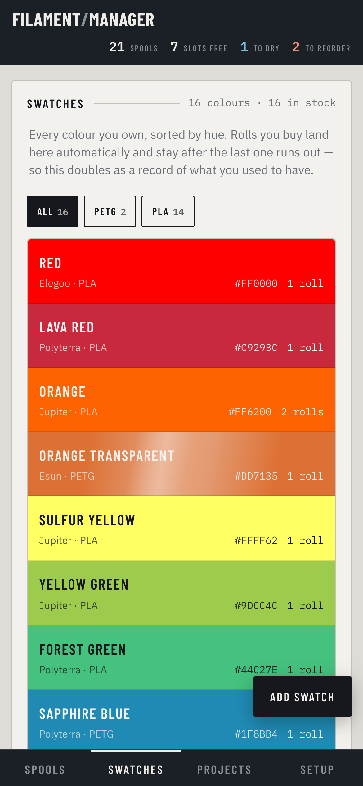

# Filament Management System

**○ Know where every spool is**\
**○ which ones need drying**\
**○ which ones to buy again**\
**○ which prints used which filaments**


On your phone, offline.

**✖ It does not track your prints and how much filament you have exactly left. You determine when a spool is full, running low or is empty.**

**▣ Spool Locations**\
On the printer, in an AMS, a filament dryer, an airtight box or
on a shelf. Drag them around, up to 4 at a time if you like.



**▣ What needs drying.**\
A sealed box can last for months, an open shelf weeks, and
the countdown follows a roll from one to the other.



**▣ What to reorder.** 



**▣ Every color you own.**\
Sorted by color and kept as a record after the last spool is gone. 



**▣ Which filaments you used for which models**\
It also reads a sliced `.3mf` to see which colors a print used, and draws a
thumbnail from a plain `.stl`.

## Install it

Open the site in Chrome on Android, then **Menu → Add to Home screen**. That is
the whole thing, and it works offline from then on.

For reminders that arrive while the app is closed, build the APK instead:

```
npm install
npm run android:install      # builds and installs over USB
```

Needs JDK 21 and the Android SDK's `platform-tools`; set `ANDROID_SDK_ROOT` if
it is not in the usual place. The script stops with an explanation rather than a
stack trace when the phone is locked or the default JDK is too new for Gradle.

## Host it yourself

Any static host — GitHub Pages, Cloudflare Pages, Netlify. It has to be **HTTPS
from a real origin**: service workers and notifications are both refused on
`file://`. Point the host at the repo and you are done.

---

<details>
<summary><b>How the reminders actually work</b></summary>

How the app was installed decides whether closing it costs you the nudge.

**From the APK — real alarms.** `@capacitor/local-notifications` hands Android a
queue of notifications, one per morning that has something overdue, at 09:00.
They fire whether or not the app is running, and they survive a reboot. The
queue is rebuilt after every save and whenever the app comes forward, so it
cannot drift out of step with the inventory. The webview has no Periodic
Background Sync at all, so this is not a nicety — it is the only thing that
works there.

**From Chrome — best effort.** The app checks on load and once an hour while it
is open; installed to the home screen, Chrome also wakes the service worker on a
schedule of its own choosing. `minInterval` is a hint, not a contract. Fine for
drying a spool, useless for anything time-critical.

Either way: at most one notification a day, and only for rolls genuinely past
their window. **iOS gets the browser path only** — Safari has no Periodic
Background Sync. Capacitor is already set up, so `npx cap add ios` would get
real alarms there without touching `index.html`.
</details>

<details>
<summary><b>How dryness is tracked</b></summary>

Not as a date. Four weeks in a sealed box costs a roll far less than four weeks
in an AMS, so a single drying date cannot answer how dry anything is — it would
bill box time at AMS rates, and hand it all back the moment the roll moved home.

Dryness is a **fraction spent**. Each stay bills for itself as the roll leaves,
the total banks on the spool, and the stay in progress adds on top. Four weeks
in a 26-week box is 4/26; two more in a 12-week AMS adds 2/12. A dryer has no
window, so it costs nothing and loses nothing. Moving a roll can never make it
drier than it was.

Taking rolls out of the dryer asks whether they came out dry — once per visit
rather than once per day, so a roll dried this morning and put back in this
afternoon gets asked about again.

`src/drying.js` holds the arithmetic. `index.html` recomputes `state.due` on
every save and everything downstream only reads that, so the service worker and
the Android alarm queue cannot disagree about the rules.
</details>

<details>
<summary><b>Layout, storage and the scripts</b></summary>

`index.html` is the app — markup, styles and logic, no bundler. `src/` holds the
parts lifted out of it, each under 200 lines and imported as ES modules.
`npm run build` is a copy into `dist/`, because Capacitor packages a directory
and the repo root also holds `android/` and `node_modules/`.

| | |
|---|---|
| `npm test` | the suite, which also enforces the 200-line ceiling |
| `npm run screenshots` | regenerates the images above from the real app |
| `npm run assets` | launcher icons, from `icon-512*.png` |
| `npm run polymaker` | refreshes Polymaker's published hex codes |

Everything lives in IndexedDB under `filament-manager` / `kv` / `state`. The
service worker reads and writes the same record, which is why IndexedDB rather
than `localStorage` — workers cannot see the latter. Records carry `updatedAt`
and deletions leave tombstones, so syncing two devices later is a merge rather
than a rewrite. Which boxes you folded shut is deliberately left out of that: it
belongs to the device in your hand, not to the data.
</details>

<details>
<summary><b>Next, if you want it</b></summary>

- **Google Drive sync.** `drive.file` scope is non-sensitive and needs no OAuth
  verification review — the app creates and owns a folder in your own Drive and
  cannot read folders it did not make. Split the state into `inventory.json`
  (written from the phone) and `projects.json` (written from the desktop) so the
  two devices rarely touch the same document.
- **A Google Picker import**, to pull in files from folders the app did not make.
- **Finish the split** of `index.html` into `src/` modules.
</details>
